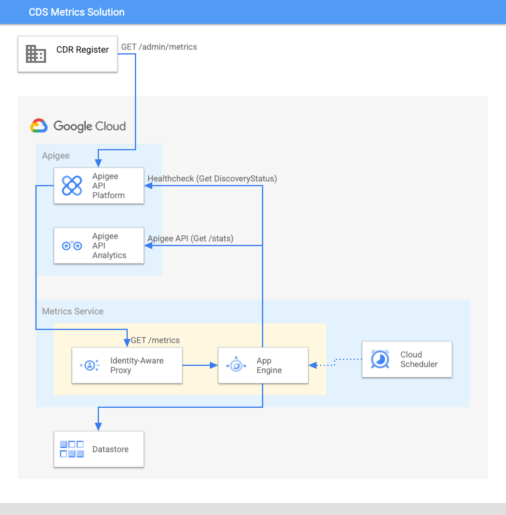

# CDS Metrics with actual Apigee Analytics 

## Introduction

The reference implementation includes a _metrics_ API that returns mock data.
We can leverage Apigee analytics capabilities to provide actual metrics.

This is a sample solution that leverages these capabilities.
The solution consists of a microservice, called __cdr-metrics__, which runs in Google App Engine and regularly polls the Apigee Analytics APIs, aggregates the results in the format required by the CDS metrics response definition and stores them in Google Cloud Datastore.

It also calculates availability metrics by regularly invoking the _discovery/status_ API included in the reference implementation.
It also implements a _GET /metrics_ endpoint that can be invoked from the CDS-Admin apiproxy in the Apigee reference implementation to retrieve the actual metrics. 

The endpoints in the cdr-metrics service are protected by Identity Aware Proxy. Only requests issued a specific service account are accepted. The CDS-Admin apiproxy runs using that service account, and hence its requests are accepted, but not others.

The following  diagram illustrates the solution architecture.



This solution is not implemented as an Apigee API proxy itself because invoking Apigee Management APIs from within an API proxy is considered an [antipattern](https://docs.apigee.com/api-platform/antipatterns/invoking-management), and also, because collecting the required information via the Apigee Management APIs may take a long time for implementations with large volumes of traffic, and may even require using asynchronous Apigee Analytics APIs. This is best handled via an external asynchronous service, rather than a synchronous API.

#### How the service uses the Apigee Analytics API
When the _metrics-service_ refreshes the metrics information it invokes a series of Apigee Analytics API requests.
These requests use standard metrics and dimensions, as well as custom dimensions (eg: _meetsperformanceslo_, _performancetier_) collected when the Apigee apiproxies used in the CDS Reference Implementation are executed.

[metrics-requests-config.js](./metrics-requests-config.js) has the configuration of all these Apigee Analytics API requests.
A separate parser then processes and aggregates each response, to obtain the metric mandated by the CDS standard.

As mentioned before, the sample solution makes use of the [Apigee Synchronous Analytics API](https://docs.apigee.com/api-platform/analytics/use-analytics-api-measure-api-program-performance). This is suitable for implementations with low volumes of traffic. For higher volumes of traffic, the [Asynchronous Analytics API](https://docs.apigee.com/api-platform/analytics/asynch-reports-api) may be required.


## Setup

A script is provided in order to deploy this solution. The script configures Datastore and AppEngine in the GCP project, deploys the service as an App Engine service, configures Identity Aware Proxy to protect the service and deploys a version of the CDS-Admin Apigee apiproxy (_CDS-AdminWithRealMetrics_) that retrieves metrics by querying the _cdr-metrics_
App Engine service.
1. Prerequisites: In order to run the deployment script you need the following prerequisites:

   - **gcloud**, Google Cloud CLI tool. Installation instructions: https://cloud.google.com/sdk/docs/install
   - **jq**. If using Linux, install it by running: sudo apt-get install jq
   - **apigeecli**, tool to manage Apigee entities. Download the appropriate binary for your platform from https://github.com/apigee/apigeecli/releases. Make sure the directory where the tool is downloaded is added to your PATH
      ````bash
      export PATH=<apigeecli directory>:$PATH
      ````
 
1. Set up environment variables. During the original deployment of the CDS reference implementation, you created a `cds-au-config.env` file. Locate this file and ensure that values for at least these environment variables are correct:

   - **PROJECT**: The GCP Project associated with the Apigee x/hybrid instance

   - **APIGEE_ENV**: The Apigee environment the reference implementation is be deployed to

   - **RUNTIME_HOST_ALIAS**: The external hostname associated with the Apigee Environment.

   - **GAE_REGION**: The region where the **cdr-metrics** service will be deployed to. Choose region from `gcloud app regions list`
   
   Once you've verified the file is correct, set the variables.

    ````bash
    export CDSAU_HOME=The directory originally used when deploying the CDS reference implementation>
    source $CDSAU_HOME/cds-au-config.env 
    ````
2.  Execute the installation script
 	````bash
    cd CDSAU_HOME
    cd consumer-data-standards-au   # The subdirectory this repository was cloned to
    
    setup/additional-solutions/metrics-service/deployCDSAdminWithRealMetrics.sh
    ````

### Running locally
If you would like to run the metrics-service locally for testing purposes, follow these steps
* Start a local Datastore emulator
    ````bash
	gcloud beta emulators datastore start
    ````
	Take note of the suggested value for setting DATASTORE_EMULATOR_HOST. This will be needed in the next step. The output suggestion will be similar to 
    ````bash
	export DATASTORE_EMULATOR_HOST=localhost:8081
	````
* Setup environment variables: The local mode can retrieve the Apigee instance configuration from environment variables. Open a different shell and execute the following commands:
  ````bash
  export APIGEE_ORG=<your-org-name> 
  export APIGEE_ENV=<your-env-name>
  export RUNTIME_HOST_ALIAS=<The external hostname associated with the Apigee Environment>
  export DATASTORE_EMULATOR_HOST=localhost:8081 # Or the value suggested in the previous step
  ````
* Start the service in local mode: This mode will store/retrieve metrics from the local Datastore emulator
  ````bash
  cd src/additional-solutions/metrics-service
  npm install
  npm start
  ````
  _metrics-service_ will start on http://localhost:8080
* You can test the following endpoints:
	* /refreshmetrics
	* /consolidatemetrics
	* /healthcheck
	* /metrics 
* To turn on debugging, edit [metrics-requests-config.js](./metrics-requests-config.js) and change the value of _defaultOptions.debug_


## Troubleshooting
The service will add logging information as Datastore _logs_ entities (Kind: _cds_metrics_). You can see them using the [Google Cloud Console Datastore section](https://pantheon.corp.google.com/datastore/entities).
When an error occurs, the _logs_ entity will have severity set to ERROR and will include some error information. You can use the Google App Engine logs to troubleshoot further. To access the logs go to the [Google Cloud Console App Engine Services section](https://pantheon.corp.google.com/appengine/services), click on Tools and select Logs.