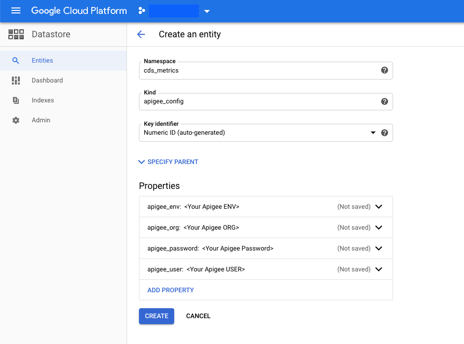

# CDS Metrics with actual Apigee Analytics 

## Introduction

The reference implementation includes a _metrics_ API that returns mock data.
We can leverage Apigee analytics capabilities to provide actual metrics.

This is a sample solution that leverages these capabilities.
The solution consists of a microservice, called __metrics-service__, which runs in Google App Engine and regularly polls the Apigee Analytics APIs, aggregates the results in the format required by the CDS metrics response definition and stores them in Google Cloud Datastore.

It also calculates availability metrics by regularly invoking the _discovery/status_ API included in the reference implementation.
It also implements a _GET /metrics_ endpoint that can be invoked from the CDS-Admin apiproxy in the Apigee reference implementation to retrieve the actual metrics.

The following  diagram illustrates the solution architecture.

This solution is not implemented as an Apigee API proxy itself because invoking Apigee Management APIs from within an API proxy is considered an [antipattern](https://docs.apigee.com/api-platform/antipatterns/invoking-management), and also, because collecting the required information via the Apigee Management APIs may take a long time for implementations with large volumes of traffic, and may even require using asynchronous Apigee Analytics APIs. This is best handled via an external asynchronous service, rather than a syncrhonous API.

#### How the service uses the Apigee Analytics API
When the _metrics-service_ refreshes the metrics information it invokes a series of Apigee Analytics API requests.
These requests use standard metrics and dimensions, as well as custom dimensions (eg: _meetsperformanceslo_, _performancetier_) collected when the Apigee apiproxies used in the CDS Reference Implementation are executed.

[metrics-requests-config.js](./metrics-requests-config.js) has the configuration of all these Apigee Analytics API requests.
A separate parser then processes and aggregates each response, to obtain the metric mandated by the CDS standard.

As mentioned before, the sample solution makes use of the [Apigee Synchronous Analytics API](https://docs.apigee.com/api-platform/analytics/use-analytics-api-measure-api-program-performance). This is suitable for implementations with low volumes of traffic. For higher volumes of traffic, the [Asynchronous Analytics API](https://docs.apigee.com/api-platform/analytics/asynch-reports-api) may be required.

## Setup

Before you can run or deploy the solution, you need to do the following:

1.  Prepare a GCP project where the solution will be deployed to:
    1. [Create a new GCP project](https://cloud.google.com/resource-manager/docs/creating-managing-projects)
    2. [Setup your project for App Engine](https://cloud.google.com/appengine/docs/standard/nodejs/console)
    1. Configure Firestore in Datastore mode: Open the [Datastore section in the Google Cloud Console](https://pantheon.corp.google.com/datastore/welcome). Create a new database. Make sure to select "Firestore in Datastore Mode". 
	1. Configure Apigee data instance in Datastore: In the Datastore section go to entities, and click on "Create Entity". Add a new entity in namespace _cds-metrics_ and kind _apigee-config_. The entity should have 4 properties of type string: _apigee_org_, _apigee_env_, _apigee_user_ and _apigee_password_. Set their values to the Apigee instance where the CDS Reference implementation has been deployed. The apigee_user should have read only access to analytics in that instance. Use the standard _Business User_ or _Read Only Admin_ roles, or ideally, create a more restricted custom role. 

	
1.  Install [gcloud](https://cloud.google.com/sdk/docs#install_the_latest_cloud_tools_version_cloudsdk_current_version), the GCP command line tool 
1.  Install dependencies. From the root folder of the cloned repo:
     
        cd src/additional-solutions/metrics-service
        npm install
1. Set environment variables:
    
		export PROJECT_ID=<Your GCP Project>
1. Login to gcloud: 

		gcloud auth login 
	You'll need to login as the project owner, or at least as a user that has "Cloud Datastore Owner" and "App Engine Admin" roles. 
1.  Install dependencies:

        npm install
1. Deploy the application to Google App Engine:

		gcloud app deploy --project $PROJECT_ID
	Make a note of the target url this service has been deployed to. You'll need the hostname when deploying the CDS Admin proxy that will communicate with this service.
1. Create the Datastore indexes: 
		
		gcloud datastore indexes create index.yaml --project $PROJECT_ID
	It may take several minutes before the indexes become operational, until then, the GET /metrics endpoint will not be operational
1. Schedule services: 

		gcloud app deploy cron.yaml --project $PROJECT_ID
	This step will schedule regular invocations of the _/refreshmetrics_, _/healthcheck/_ and _/consolidatemetrics_ endpoints. The frequency can be adjusted by editing [cron.yaml](./cron.yaml) and redeploying the file.
1. Deploy a different version of the CDS-Admin proxy that returns actual metrics: This version uses the _metrics-service_ as a backend. From the root folder of the cloned repo:

		export APIGEE_ORG=<your-org-name>
        export APIGEE_ENV=<your-env-name>
        export APIGEE_USER=<your-user-name>
        export APIGEE_PASSWORD='<your-password>'
		export METRICS_SERVICE_HOST=<the hostname the metrics service has been deployed to>  # Don't include the protocol, just the hostname
		cd setup
        ./deployCDSAdminWithRealMetrics.sh 

### Running locally
If you would like to run the metrics-service locally for testing purposes, follow these steps
* Start a local Datastore emulator

		gcloud beta emulators datastore start
	Take note of the suggested value for setting DATASTORE_EMULATOR_HOST. This will be needed in the next step. The output suggestion will be similar to 

		export DATASTORE_EMULATOR_HOST=localhost:8081
* Setup environment variables: The local mode can retrieve the Apigee instance configuration from environment variables instead of an entity in Datastore. Open a different shell and execute the following commands:

		export APIGEE_ORG=<your-org-name> 
        export APIGEE_ENV=<your-env-name>
        export APIGEE_USER=<your-user-name>
        export APIGEE_PASSWORD='<your-password>'
		export DATASTORE_EMULATOR_HOST=localhost:8081 # Or the value suggested in the previous step
* Start the service in local mode: This mode will store/retrieve metrics from the local Datastore emulator

        cd src/additional-solutions/metrics-service
		npm install
    	npm start
  _metrics-service_ will start on http://localhost:8080
* You can test the following endpoints:
	* /refreshmetrics
	* /consolidatemetrics
	* /healthcheck
	* /metrics 
* To turn on debugging, edit [metrics-requests-config.js](./metrics-requests-config.js) and change the value of _defaultOptions.debug_

## Securing the service 
The service should only be externally accesible by the Apigee instance where the CDS reference implementation is deployed.

If you have a Standard or Enterprise Apigee licence, all requests originating from your Apigee instance have a static set of IP addresses. You can create [firewall rules](https://cloud.google.com/appengine/docs/standard/nodejs/creating-firewalls#creating_firewall_rules) in Google App Engine to deny access from any IP address except these. 
To find which static IP addresses are associated with your Apigee instance:

	curl https://api.enterprise.apigee.com/v1/o/$APIGEE_ORG/eips -u $APIGEE_USER:$APIGEE_PASSWORD

## Troubleshooting
The service will add logging information as Datastore _logs_ entities (Kind: _cds-metrics_). You can see them using the [Google Cloud Console Datastore section](https://pantheon.corp.google.com/datastore/entities).
When an error occurs, the _logs_ entity will have severity set to ERROR and will include some error information. You can use the Google App Engine logs to troubleshoot further. To access the logs go to the [Google Cloud Console App Engine Services section](https://pantheon.corp.google.com/appengine/services), click on Tools and select Logs.