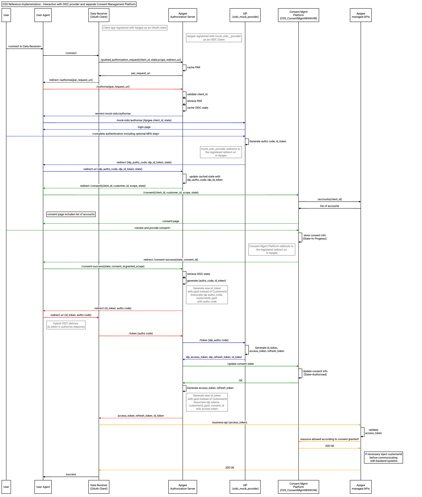

This API Proxy (*oidc*) implements one of the multiple patterns in which Apigee can interact with an Identity Provider. In this case, it interacts with a standalone OIDC provider that issues identity tokens, while Apigee issues opaque access and refresh tokens. It also interacts with a Consent Management Solution (Currently implemented as an Apigee apiproxy) that keeps tracks of consents given by end users and manages the consent screens. Apigee is the source of truth for API clients (Apps), while the OIDC provider is the source of truth for end users.

The following sequence diagram illustrates in detail this interaction pattern.

